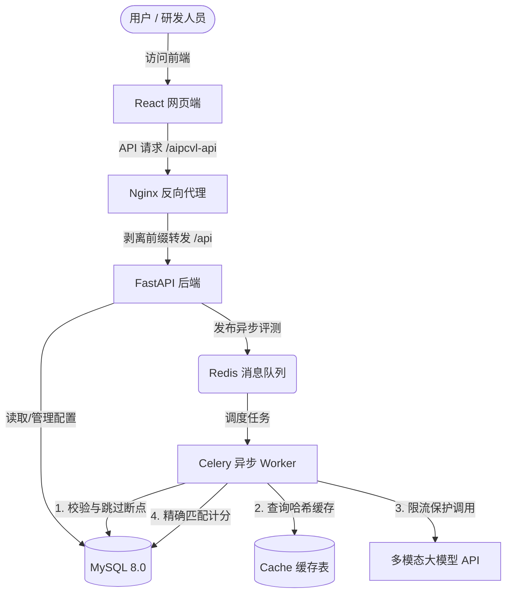

# aipcVL (未完成版)

[](https://www.python.org/)
[](https://fastapi.tiangolo.com/)
[](https://react.dev/)
[](https://www.mysql.com/)
[](https://redis.io/)

> **aipcVL** (AI Perception, Comprehension, Vision & Language) 是一款专为多模态视觉语言大模型（如 GPT-4o, Claude 3.5, Qwen-VL 等）设计的自动化、低成本评测系统。该系统专注于对模型的感知、理解、OCR 识别与图表推理能力进行批量运行、客观指标统计与可视化错例分析。

---

## ✦ 核心特性

*   **断点续爬机制**：系统异常中断或重启后，自动检索已保存结果，跳过已处理样本，杜绝重复调用和额外计费。
*   **多层级缓存优化**：针对 `(模型, 图片, Prompt)` 进行哈希计算并本地持久化，辅以图像文件本地缓存，极大地降低 API 计费开销与网络 I/O 延迟。
*   **细粒度速率控制**：实现高可靠的模型请求频控模块（基于令牌桶等算法），避免调用外部大模型 API 时触发 `HTTP 429` 频率限制。
*   **双模型并排对比**：提供直观的双模型对比页，能够对同一数据集上两个模型的通过率、耗时、估计成本进行全局对齐，并一键筛选和对齐低分（< 0.5）错例。
*   **隔离部署设计**：采用前端静态子路径与反向代理前缀剥离方案，前后端无缝独立部署，后端代码对路径前缀无感知。

---

## ✦ 系统架构



---

## ✦ 技术栈

| 模块 | 技术选型 | 说明 |
| :--- | :--- | :--- |
| **前端** | React 18 / Ant Design / Vite / Axios | 采用现代玻璃拟态（Glassmorphism）暗色调设计 |
| **后端** | FastAPI / SQLAlchemy / Pydantic | 提供高性能、轻量级的 RESTful API 接口 |
| **异步任务** | Celery / Redis | 处理耗时较长的多模态推理与评测逻辑 |
| **数据库** | MySQL 8.0 / PyMySQL | 灵活持久化存储模型配置、数据集快照与评测明细 |
| **部署反代** | Nginx | 实现前端静态资源托管与 `/aipcvl-api` 的路径重写转发 |

---

## ✦ 快速开始

### 1. 准备工作

确保本地已安装 Python 3.9+、Node.js 16+、MySQL 8.0 和 Redis。

### 2. 后端配置与启动

1. 进入后端目录：
   ```bash
   cd backend
   ```
2. 创建并激活虚拟环境：
   ```bash
   python -m venv venv
   # Windows
   .\venv\Scripts\activate
   # macOS/Linux
   source venv/bin/activate
   ```
3. 安装依赖：
   ```bash
   pip install -r requirements.txt
   ```
4. 数据库初始化：
   - 启动 MySQL 并创建名为 `aipcvl` 的数据库（或运行 `python create_db.py` 自动创建）。
   - 修改 `app/config.py` 中的数据库连接串。
   - 运行数据表初始化：
     ```bash
     python init_db.py
     ```
5. 启动后端 API 服务：
   ```bash
   uvicorn app.main:app --reload --host 127.0.0.1 --port 8000
   ```
6. 启动 Celery Worker 进行评测调度：
   ```bash
   celery -A app.worker.celery_app worker --loglevel=info -P threads
   ```

### 3. 前端配置与启动

1. 进入前端目录：
   ```bash
   cd ../frontend
   ```
2. 安装依赖包：
   ```bash
   npm install
   ```
3. 启动本地开发服务（自带代理配置）：
   ```bash
   npm run dev
   ```
4. 访问本地：[http://localhost:5173/aipcvl](http://localhost:5173/aipcvl)

---

## ✦ 前端路径重写配置 (Production)

当处于生产部署时，前端请求 `/aipcvl-api/...` 将由 Nginx 统一剥离前缀并转发给后端的 `/api/...`：

```nginx
# 托管 React 静态资源
location /aipcvl/ {
    alias /path/to/frontend/dist/;
    try_files $uri $uri/ /aipcvl/index.html;
    index index.html;
}

# 反向代理后端 API 接口
location /aipcvl-api/ {
    proxy_pass http://127.0.0.1:8000/api/;
    proxy_set_header Host $host;
    proxy_set_header X-Real-IP $remote_addr;
}
```

---

## ✦ 项目状态

当前版本为 **aipcVL (未完成版)**。已打通核心主流程，支持上传数据集、触发批量评测、断点续跑以及多模型指标与错例对比。  
后续优化方向：
- [ ] 增加多模态大模型更细粒度能力的雷达图分析。
- [ ] 引入 LLM-as-a-Judge 多模型联合打分与打分理由说明。
- [ ] 丰富内置的视觉/OCR/选择题自动评判模版与公式。
